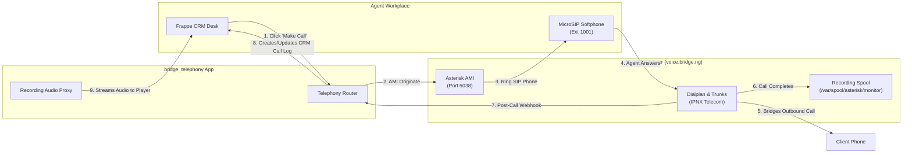

# FreePBX & Frappe CRM Telephony Integration — Administrator & User Guide

This guide covers the architecture, configuration, operation, and troubleshooting of the **FreePBX** and **Frappe CRM** telephony integration via the custom app **`bridge_telephony`**.

---

## 1. Overview & Architecture

The integration bridges your on-premise / cloud **FreePBX 17 / Asterisk 22** server (`voice.bridge.ng` / `172.187.235.228`) with **Frappe CRM**.



### Key Capabilities
* **Outbound Click-to-Call:** Place calls from CRM Lead or Deal records with one click. FreePBX rings your MicroSIP extension first; when you answer, it dials the contact via the IPNX trunk.
* **In-Browser Audio Player:** Two-way audio recordings are fetched and securely streamed into the Frappe CRM `CRM Call Log` audio player with full pause, seek, and scrub support.
* **Inbound Screen-Pop:** Real-time modal popups appear on the agent's screen when a client calls the PBX DID, identifying matching Leads or prompting instant Lead creation.
* **Zero Disruption Dialplan:** Background asynchronous notifications ensure Asterisk call handling is never blocked or delayed.

---

## 2. FreePBX Server Configuration

### A. Asterisk Manager Interface (AMI) User
The AMI user credentials allow Frappe CRM to authenticate and send call commands to FreePBX.

* **Configuration file:** `/etc/asterisk/manager_custom.conf`
* **Account details:**
  ```ini
  [frappe_crm]
  secret = FrappeCrm_Voice2026_SecureKey
  deny = 0.0.0.0/0.0.0.0
  permit = 127.0.0.1/255.255.255.255,10.0.0.0/8,172.16.0.0/12,192.168.0.0/16,105.112.0.0/15,102.88.0.0/14,0.0.0.0/0.0.0.0
  read = system,call,log,verbose,command,agent,user,config,dtmf,reporting,cdr,dialplan,originate
  write = system,call,log,verbose,command,agent,user,config,dtmf,reporting,cdr,dialplan,originate
  writetimeout = 5000
  ```
* Reload changes on Asterisk:
  ```bash
  sudo asterisk -rx "manager reload"
  ```

### B. Dialplan Hangup & Inbound Screen-Pop Hooks
* **Configuration file:** `/etc/asterisk/extensions_custom.conf`
* **Hook implementations:**
  ```ini
  ; Frappe CRM Telephony Integration Dialplan Hooks

  [from-pstn-custom]
  exten => _.,1,NoOp(Frappe CRM Inbound Screen-Pop Hook: Caller=${CALLERID(num)} DID=${EXTEN})
  same => n,System(/usr/bin/curl -s -m 3 -X POST -H "Host: local.bridge.ng" http://127.0.0.1:18000/api/method/bridge_telephony.api.freepbx.incoming_call -d "caller=${CALLERID(num)}&did=${EXTEN}&destination=1001" >/dev/null 2>&1 &)
  same => n,Goto(ext-did-catchall,${EXTEN},1)

  [macro-hangupcall-custom]
  exten => s,1,NoOp(Frappe CRM Hangup Hook: uniqueid=${CDR(uniqueid)} duration=${CDR(duration)} rec=${CDR(recordingfile)})
  same => n,System(/usr/bin/curl -s -m 5 -X POST -H "Host: local.bridge.ng" http://127.0.0.1:18000/api/method/bridge_telephony.api.freepbx.webhook -d "uniqueid=${CDR(uniqueid)}&src=${CDR(src)}&dst=${CDR(dst)}&duration=${CDR(duration)}&billsec=${CDR(billsec)}&disposition=${CDR(disposition)}&recording=${CDR(recordingfile)}" >/dev/null 2>&1 &)
  same => n,Return()
  ```
* Reload changes on Asterisk:
  ```bash
  sudo asterisk -rx "dialplan reload"
  ```

### C. Enabling Call Recording in FreePBX
To ensure call audio is saved for CRM playback:
1. In FreePBX GUI, navigate to **Applications** > **Extensions**.
2. Edit extension `1001` (and any other agent extensions).
3. Under the **Recording** tab, set:
   * **Inbound External Calls:** `Force`
   * **Outbound External Calls:** `Force`
   * **Inbound Internal Calls:** `Yes`
   * **Outbound Internal Calls:** `Yes`
4. Click **Submit** and then **Apply Config**.

---

## 3. Frappe CRM Configuration

### A. Bridge Telephony Settings
In Frappe Desk, search for **Bridge Telephony Settings**:
* **Enabled:** `Checked`
* **Telephony Provider:** `FreePBX`
* **FreePBX Section:**
  * **Enable FreePBX Integration:** `Checked`
  * **Asterisk AMI Host:** `172.187.235.228`
  * **Asterisk AMI Port:** `5038`
  * **AMI Username:** `frappe_crm`
  * **AMI Secret:** `FrappeCrm_Voice2026_SecureKey`
  * **Dialplan Context:** `from-internal`
  * **FreePBX Recording Base URL:** `https://voice.bridge.ng`
* Click **Save**, then click the **Test Connection** button in the top right. You should see:
  > *Successfully connected and authenticated with FreePBX AMI!*

### B. Mapping Agents to Extensions
1. Search for **CRM Telephony Agent** in Desk.
2. Open or create a record for the user (e.g. `Administrator` or your CRM email).
3. Set:
   * **Default Medium:** `FreePBX`
   * **FreePBX Enabled:** `Checked`
   * **FreePBX Extension:** `1001`
4. Click **Save**.

---

## 4. How to Use

### Outbound Click-to-Call
1. Open any **CRM Lead** or **CRM Deal** with a phone or mobile number.
2. Click the **Make Call** button under the *Telephony* action menu, or click the phone icon next to the mobile number field.
3. Your MicroSIP softphone will ring immediately on extension `1001`.
4. Answer MicroSIP; FreePBX will immediately dial the client number via the IPNX trunk.
5. A `CRM Call Log` record is automatically created in `Initiated` status and updates to `Completed` when the call ends.

### Audio Recording Playback
1. Open the **CRM Call Log** list.
2. Click on any completed call.
3. The embedded audio player will display the recording duration and allow you to play, pause, seek, and download the audio directly in your browser.

### Inbound Screen-Pop
1. When a client calls your FreePBX DID (e.g. via IPNX trunk), a floating modal appears on the agent's Desk.
2. The modal displays:
   * The caller's phone number
   * The destination extension (`1001`)
   * Linked Lead details (Lead title, company name)
   * Quick action buttons: **Open Lead** or **Create Lead**

---

## 5. Troubleshooting & Verification

| Issue | Potential Cause | Solution |
| :--- | :--- | :--- |
| **"Authentication failed" on Test Connection** | Incorrect AMI username or password | Verify secret in `Bridge Telephony Settings` matches `/etc/asterisk/manager_custom.conf`. |
| **"Connection refused" on Port 5038** | Port 5038 not allowed or Asterisk not running | Check `sudo asterisk -rx "core show version"` and ensure port 5038 is listening. |
| **MicroSIP does not ring on Click-to-Call** | Extension not registered or wrong extension mapped | Check `sudo asterisk -rx "pjsip show endpoints"` on FreePBX to verify extension `1001` is Available. |
| **Call Log created but duration is 0** | Hangup hook not called | Verify `/etc/asterisk/extensions_custom.conf` contains `[macro-hangupcall-custom]`. |
| **Recording playback says "File not found"** | Recording not enabled on extension | Ensure recording is set to `Force` in FreePBX Extension settings. |
